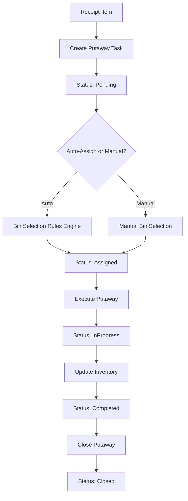
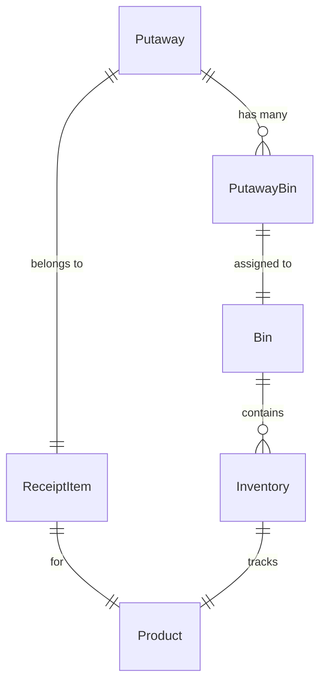

# Putaway Cycle Implementation - Complete Guide

This document covers the complete Putaway Cycle implementation for the WMS application, including architecture, setup, usage, testing, and troubleshooting.

## Table of Contents

- [Overview](#overview)
- [Architecture](#architecture)
- [Features](#features)
- [Database Schema Changes](#database-schema-changes)
- [Service Registration](#service-registration)
- [Running Migrations](#running-migrations)
- [User Workflows](#user-workflows)
- [Auto-Assign Bins Algorithm](#auto-assign-bins-algorithm)
- [Testing](#testing)
- [API Endpoints](#api-endpoints)
- [Troubleshooting](#troubleshooting)
- [Future Enhancements](#future-enhancements)

---

## Overview

The Putaway Cycle manages the process of moving received inventory from the receiving area into designated warehouse bins. This implementation provides:

- **Automated bin selection** using intelligent rules
- **Manual override** capabilities for operators
- **Transactional integrity** with rollback on errors
- **Concurrency control** to prevent conflicts
- **Complete audit trail** tracking who did what and when
- **Flexible status workflow**: Pending → Assigned → InProgress → Completed → Closed

---

## Architecture



### Components

#### Data Layer (WMS.DL)
- **Entities**: `Putaway`, `PutawayBin` (existing - enhanced with new fields)
- **Enums**: `PutawayStatus` (Pending, Assigned, InProgress, Completed, Closed)
- **Repository**: Uses `GenericRepository<T>` via `UnitOfWork` pattern

#### Business Logic Layer (WMS.BLL)
- **Service**: `PutawayService` implementing `IPutawayService`
- **DTOs**: `PutawayDto`, `PutawayBinDto`, `CreatePutawayDto`, `AutoAssignResultDto`, `BinCapacityDto`, `PaginationFilter`

#### Presentation Layer (WMS_DEPI_GRAD)
- **Controller**: `PutawayController` with actions for Index, Details, Create, AutoAssign, AssignManual, Execute, Close
- **Views**: 6 Razor views with Bootstrap 5 styling
- **ViewModels**: Comprehensive ViewModels for each view

---

## Features

### 1. Create Putaway Tasks
- Create putaway tasks for receipt items
- Validates available quantity (QtyReceived - already assigned to other putaways)
- Sets status to Pending

### 2. Auto-Assign Bins
Intelligent algorithm that:
- **Prioritizes co-location**: Bins already containing the same product
- **Considers zone priorities**: Lower zone IDs get higher priority (configurable)
- **Maximizes bin utilization**: Fills bins to capacity using greedy algorithm
- **Validates capacity**: Only suggests bins with sufficient available space
- **Supports splitting**: Distributes quantity across multiple bins if needed

### 3. Manual Bin Assignment
- Operator can override auto-assignments
- Real-time capacity validation
- Dynamic add/remove bin assignments
- Total quantity must match putaway quantity
- Live summary display (Total Required vs Assigned)

### 4. Execute Putaway with Concurrency Control
- Updates `Putaway` status to InProgress, then Completed
- Creates or increments `Inventory` records per bin
- Maps batch/lot information from ReceiptItem
- **Optimistic concurrency control** using `[ConcurrencyCheck]` on Status
- Prevents concurrent execution by multiple users
- Transactional - rollback on any error

### 5. Close Putaway
- Final verification step
- Marks putaway as Closed
- Can only close Completed putaways

### 6. Search & Filter
- Search by SKU or Product Name
- Filter by status
- Pagination support (configurable page size)

---

## Database Schema Changes

### Updated Entities

#### Putaway
```csharp
public class Putaway : BaseAuditableEntity<int>
{
    public int Qty { get; set; }
    
    [ConcurrencyCheck]
    public PutawayStatus Status { get; set; }

    // Workflow timestamps
    public DateTime? AssignedOn { get; set; }
    public DateTime? CompletedOn { get; set; }
    public DateTime? ClosedOn { get; set; }

    // User tracking
    public string? PerformedBy { get; set; }
    public string? ClosedBy { get; set; }

    // Navigation properties
    public int ReceiptItemId { get; set; }
    public ReceiptItem ReceiptItem { get; set; } = null!;
    public IReadOnlyCollection<PutawayBin> PutawayBins { get; set; }
}
```

#### PutawayStatus Enum
```csharp
public enum PutawayStatus
{
    Pending,
    Assigned,
    InProgress,
    Completed,
    Closed
}
```

### Entity Relationships



---

## Service Registration

The `PutawayService` is already registered in `DependencyInjection.cs`:

```csharp
services.AddScoped<IPutawayService, PutawayService>();
```

No additional configuration needed.

---

## Running Migrations

### 1. Add Migration

```powershell
dotnet ef migrations add UpdatePutawayCycleEntities --project WMS.DL --startup-project WMS_DEPI_GRAD
```

### 2. Review Migration

Navigate to `WMS.DL/Migrations/<timestamp>_UpdatePutawayCycleEntities.cs` and review the generated migration. Ensure:
- New columns added to `Putaways` table
- New enum values in `PutawayStatus`
- No FK cascade conflicts

### 3. Apply Migration

```powershell
dotnet ef database update --project WMS.DL --startup-project WMS_DEPI_GRAD
```

### 4. Verify Database

Connect to your SQL Server database and verify:
```sql
SELECT COLUMN_NAME, DATA_TYPE, IS_NULLABLE
FROM INFORMATION_SCHEMA.COLUMNS
WHERE TABLE_NAME = 'Putaways';
```

Expected new columns:
- `AssignedOn` (datetime2, nullable)
- `CompletedOn` (datetime2, nullable)
- `ClosedOn` (datetime2, nullable)
- `PerformedBy` (nvarchar, nullable)
- `ClosedBy` (nvarchar, nullable)

---

## User Workflows

### Workflow 1: Auto-Assign and Execute

1. **Navigate to Putaway Index**
   ```
   https://localhost:[port]/Putaway/Index
   ```

2. **Create New Putaway**
   - Click "Create New Putaway"
   - Select Receipt Item from dropdown
   - Enter quantity (must not exceed available)
   - Click "Create Putaway"

3. **Auto-Assign Bins**
   - System redirects to Auto-Assign page
   - Review suggested bin assignments
   - Check capacity indicators (progress bars)
   - Click "Accept Assignment" if satisfied
   - Or click "Manual Assignment Instead" to override

4. **Execute Putaway**
   - From Details page, click "Execute Putaway"
   - Review before/after inventory summary
   - Click "Confirm & Execute"
   - System updates inventory and sets status to Completed

5. **Close Putaway**
   - From Details page, click "Close Putaway"
   - Confirm closure
   - Status changes to Closed

### Workflow 2: Manual Assignment

1. **Create Putaway** (same as above)

2. **Manual Assignment**
   - Click "Manual Assignment Instead" from Auto-Assign page
   - Or click "Manual Assign" from Index/Details
   - Select bin from dropdown
   - Enter quantity
   - Click "Add Bin Assignment" to add more bins
   - Total assigned must equal required quantity
   - Click "Save Assignments"

3. **Execute and Close** (same as Workflow 1)

---

## Auto-Assign Bins Algorithm

###  Rules (in priority order)

1. **Filter Available Bins**
   - Only bins with `AvailableCapacity > 0`
   - `AvailableCapacity = Bin.Capacity - Sum(Inventory.Quantity)`

2. **Co-Location Preference**
   - Bins already containing the same `ProductId` are prioritized
   - Helps with inventory consolidation and picking efficiency

3. **Zone Priority**
   - Bins sorted by `Zone.Id` (lower ID = higher priority)
   - Future: Can add `Zone.Priority` field for explicit priority

4. **Capacity Optimization**
   - Sorts by available capacity (descending)
   - Fills larger bins first to minimize bin usage

5. **Greedy Assignment**
   - Fills first bin to capacity or putaway quantity (whichever is less)
   - Moves to next bin if quantity remaining
   - Continues until all quantity assigned or bins exhausted

### Example

**Scenario**: Putaway 200 units of Product A

**Available Bins**:
- BIN-001: Capacity 80, Current: 0, Same Product: No, Zone: 1
- BIN-002: Capacity 100, Current: 30, Same Product: Yes (Product A: 30 units), Zone: 1
- BIN-003: Capacity 150, Current: 0, Same Product: No, Zone: 2

**Algorithm Output**:
1. BIN-002: 70 units (prioritized for co-location, has 70 available)
2. BIN-001: 80 units (Zone 1 higher priority than Zone 2)
3. BIN-003: 50 units (remaining quantity)

**Result**: Fully assigned across 3 bins, co-location utilized.

---

## Testing

### Unit Tests

Located at: `WMS.Tests/Services/PutawayServiceTests.cs`

**Run all unit tests**:
```powershell
dotnet test --filter "FullyQualifiedName~PutawayServiceTests"
```

**Test Coverage**:
- ✅ Create putaway - valid scenario
- ✅ Create putaway - invalid ReceiptItem
- ✅ Create putaway - excessive quantity
- ✅ Auto-assign - sufficient capacity
- ✅ Auto-assign - split across multiple bins
- ✅ Auto-assign - insufficient capacity
- ✅ Auto-assign - co-location preference
- ✅ Manual assign - valid assignments
- ✅ Manual assign - qty mismatch
- ✅ Manual assign - capacity exceeded
- ✅ Execute - create new inventory
- ✅ Execute - increment existing inventory
- ✅ Execute - wrong status
- ✅ Close - valid
- ✅ Close - invalid status
- ✅ Get paged - with search

**Expected Result**: 18 tests passed

### Manual UI Testing

#### Test Scenario 1: Complete Cycle
1. Start application: `dotnet run --project WMS_DEPI_GRAD`
2. Navigate to `/Putaway/Index`
3. Create new putaway for receipt item with 100 units
4. Use auto-assign
5. Verify suggested bins make sense (check capacity bars)
6. Accept assignment
7. Verify Details page shows assigned bins
8. Execute putaway
9. Navigate to `/Inventory/Index` and verify inventory created
10. Return to putaway, close it
11. Verify status = Closed

#### Test Scenario 2: Manual Override
1. Create putaway
2. Click "Manual Assignment Instead"
3. Add 2 bins manually
4. Split quantity: 60 + 40 = 100
5. Try to submit with 60 + 30 = 90 → should get validation error
6. Fix to 60 + 40, submit
7. Execute and verify

#### Test Scenario 3: Concurrency
1. Open putaway in two browser tabs
2. In Tab 1: Execute putaway
3. In Tab 2: Try to execute same putaway → should get concurrency error

#### Test Scenario 4: Validation
1. Try to create putaway with qty > available → error
2. Try to manually assign bin with insufficient capacity → error
3. Try to close putaway with status = Assigned → error

---

## API Endpoints

All endpoints require authentication (`[Authorize]`).

### GET /Putaway/Index
**Description**: Lists putaways with pagination and filtering  
**Query Params**:
- `page` (int, default: 1)
- `pageSize` (int, default: 10)
- `search` (string, optional): Search SKU or Product Name
- `status` (string, optional): Filter by status (Pending, Assigned, InProgress, Completed, Closed)

**Returns**: `PutawayIndexViewModel` with paginated list

---

### GET /Putaway/Details/{id}
**Description**: Shows detailed putaway information  
**Route Param**: `id` (int) - Putaway ID  
**Returns**: `PutawayDetailsViewModel` with full details

---

### GET /Putaway/Create
**Description**: Shows create putaway form  
**Returns**: `CreatePutawayViewModel` with available receipt items

### POST /Putaway/Create
**Description**: Creates new putaway task  
**Form Data**:
- `SelectedReceiptItemId` (int)
- `Qty` (int)

**Returns**: Redirect to `/Putaway/AutoAssign/{id}`

---

### GET /Putaway/AutoAssign/{id}
**Description**: Runs auto-assign algorithm and shows results  
**Route Param**: `id` (int) - Putaway ID  
**Returns**: `AutoAssignViewModel` with suggested bins

### POST /Putaway/AcceptAutoAssign/{id}
**Description**: Accepts auto-assigned bins  
**Route Param**: `id` (int) - Putaway ID  
**Form Data**: `suggestedBins` (array of PutawayBinDto)  
**Returns**: Redirect to `/Putaway/Details/{id}`

---

### GET /Putaway/AssignManual/{id}
**Description**: Shows manual assignment form  
**Route Param**: `id` (int) - Putaway ID  
**Returns**: `AssignManualViewModel`

### POST /Putaway/AssignManual/{id}
**Description**: Saves manual bin assignments  
**Route Param**: `id` (int) - Putaway ID  
**Form Data**: `assignments` (array of PutawayBinDto)  
**Returns**: Redirect to `/Putaway/Details/{id}`

---

### GET /Putaway/Execute/{id}
**Description**: Shows execution confirmation  
**Route Param**: `id` (int) - Putaway ID  
**Returns**: `ExecutePutawayViewModel`

### POST /Putaway/ExecuteConfirm/{id}
**Description**: Executes putaway (updates inventory)  
**Route Param**: `id` (int) - Putaway ID  
**Returns**: Redirect to `/Putaway/Details/{id}`  
**Errors**: Concurrency error if modified by another user

---

### POST /Putaway/Close/{id}
**Description**: Closes completed putaway  
**Route Param**: `id` (int) - Putaway ID  
**Returns**: Redirect to `/Putaway/Details/{id}`

---

## Troubleshooting

### Migration Issues

**Problem**: FK cascade path conflicts  
**Solution**: Entity configurations use `OnDelete: NoAction`. If migration fails, manually edit generated migration to set:
```csharp
.OnDelete(DeleteBehavior.NoAction)
```

---

**Problem**: "Column names in each table must be unique"  
**Solution**: Check for duplicate column names. The new fields (AssignedOn, CompletedOn, etc.) should not conflict with BaseAuditableEntity fields.

---

### Concurrency Errors

**Problem**: `DbUpdateConcurrencyException` when executing putaway  
**Expected Behavior**: This is by design. It means another user modified the putaway between loading and saving.  
**User Message**: "This putaway has been modified by another user. Please refresh and try again."  
**Resolution**: Refresh the page and retry.

---

### Auto-Assign Finds No Bins

**Problem**: Auto-assign returns 0 suggestions  
**Possible Causes**:
1. All bins are at full capacity
2. No bins exist in the database
3. All available bins have insufficient capacity

**Troubleshooting**:
1. Check bin capacities: `SELECT Id, Code, Capacity FROM Bins`
2. Check current inventory usage:
   ```sql
   SELECT BinId, SUM(Quantity) as UsedCapacity
   FROM Inventories
   GROUP BY BinId
   ```
3. Add more bins or increase bin capacities

---

### Inventory Not Created

**Problem**: After executing putaway, no inventory appears  
**Troubleshooting**:
1. Check putaway status - should be Completed
2. Check `PutawayBins` table - should have records for this putaway
3. Check application logs for errors during `ExecutePutawayAsync`
4. Verify transactions committed: `SELECT * FROM Inventories WHERE ProductId = [your productid]`

---

### UI JavaScript Errors

**Problem**: Manual assignment add/remove buttons not working  
**Solution**:
1. Check browser console for JavaScript errors
2. Ensure jQuery and Bootstrap are loaded (check `_Layout.cshtml`)
3. Clear browser cache

---

## Future Enhancements

### 1. Configurable Auto-Assign Rules
- Externalize rules to configuration file
- Add weights to different factors (co-location vs. zone priority)
- Support for custom bin ranking algorithms

### 2. Zone Priority Field
- Add `Priority` field to `Zone` entity
- Use explicit priority instead of ID-based ordering

### 3. Reserved Bins
- Add `IsReserved` flag to `Bin` entity
- Exclude reserved bins from auto-assign
- Allow manual assignment to reserved bins with warning

### 4. Batch Tracking
- Support for lot-controlled inventory
- Force unique lot per bin or allow mixed lots
- Expiry date management and FEFO (First Expired, First Out) integration

### 5. Partial Putaway Completion
- Allow executing putaway for partial quantity
- Create follow-up putaway task for remaining quantity
- Track parent-child putaway relationships

### 6. Undo Execution
- Add "Undo" capability for just-executed putaways
- Reverse inventory movements
- Reset putaway to Assigned status
- Time-limited undo window (e.g., 5 minutes)

### 7. Bin Restrictions
- BinType compatibility with ProductType
- Weight and volume constraints
- Hazmat segregation rules

### 8. Mobile UI
- Responsive design optimization for tablets/mobile
- Barcode scanning integration
- Voice-directed putaway

### 9. Performance Metrics
- Track average putaway time
- Bin fill rate optimization
- Operator productivity dashboard

### 10. Integration with Picking
- Reserve bins during putaway for outbound orders
- Cross-docking support (direct from receiving to shipping)

---

## Support & Contact

For issues or questions:
- Check this README first
- Review application logs in `logs/` directory
- Check unit test results for validation logic
- Contact development team

---

**Version**: 1.0  
**Last Updated**: December 2025  
**Authors**: WMS Development Team
